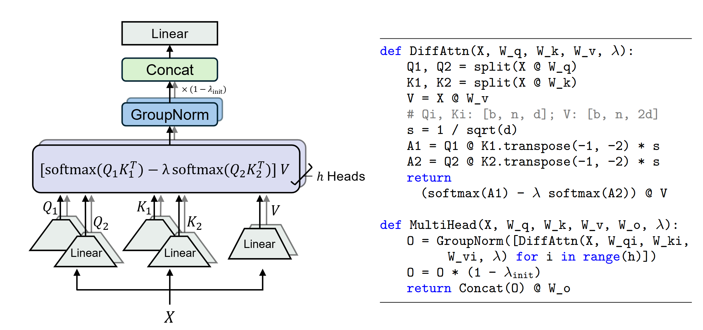

# Differential Transformer
## Approach

  

## Contents
`multihead_diffattn.py` contains naive implementation of multi-head differential attention.

`multihead_flashdiff_1.py` contains multi-head differential attention implemented with FlashAttention, for packages that support different qk/v dimensions (e.g., our [customized-flash-attention](https://aka.ms/flash-diff) and [xformers](https://github.com/facebookresearch/xformers)).

`multihead_flashdiff_2.py` contains multi-head differential attention implemented with FlashAttention, for packages that **do not** support different qk/v dimensions (e.g., [flash-attention](https://github.com/Dao-AILab/flash-attention)).

Also refer to [PR](https://github.com/microsoft/unilm/pull/1633) for another implementation.