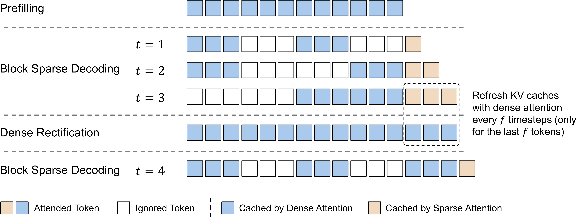
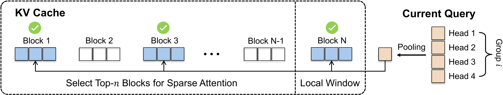
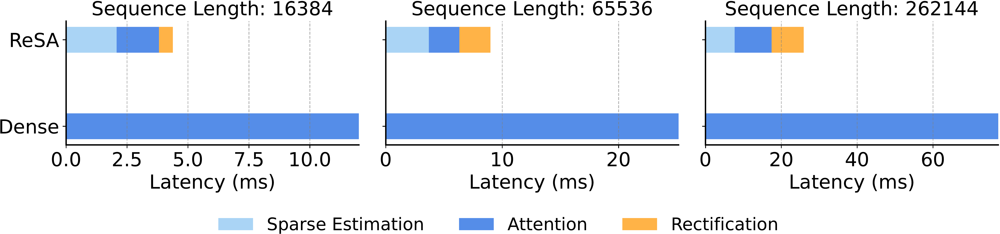

# Rectified Sparse Attention (ReSA)

## 📝 TL;DR

Rectified Sparse Attention (ReSA) improves sparse decoding by periodically refreshing the KV cache, achieving near-lossless quality and up to 2.42x speedup at 256K context length.

## 📝 Abstract

Efficient long-sequence generation is a critical challenge for Large Language Models. While recent sparse decoding methods improve efficiency, they suffer from KV cache misalignment, where approximation errors accumulate and degrade generation quality. In this work, we propose Rectified Sparse Attention (ReSA), a simple yet effective method that combines block-sparse attention with periodic dense rectification. By refreshing the KV cache at fixed intervals using a dense forward pass, ReSA bounds error accumulation and preserves alignment with the pretraining distribution. Experiments across math reasoning, language modeling, and retrieval tasks demonstrate that ReSA achieves near-lossless generation quality with significantly improved efficiency. Notably, ReSA delivers up to 2.42x end-to-end speedup under decoding at 256K sequence length, making it a practical solution for scalable long-context inference.

## Method Overview







### Performance Comparison on Math Reasoning Tasks

| Setting                      | Gaokao2023En | Minerva | OlympiadBench | AIME24  | AMC23  | **Avg**  |
|------------------------------|--------------|---------|---------------|---------|--------|----------|
| **R1-Qwen-Distill 1.5B**     |              |         |               |         |        |          |
| Dense                        | 71.6         | 28.7    | 40.8          | 27.4    | 65.6   | **46.82**    |
| Sparse                       | 67.9         | **29.0**| 38.7          | 21.3    | 60.6   | **43.50**    |
| ReSA                         | **71.8**     | 28.1    | **39.5**      | **23.0**| **65.4**| **45.56**   |
| **Avg Length**               | 4915.8       | 6390.8  | 8991.6        | 12126.4 | 7866.4 | 8058.2   |
| **R1-Qwen-Distill 7B**       |              |         |               |         |        |          |
| Dense                        | 73.8         | 40.4    | 52.3          | 48.1    | 89.0   | **60.72**    |
| Sparse                       | 72.9         | 38.1    | 48.4          | 46.1    | 83.1   | **57.72**    |
| ReSA                         | **73.5**     | **39.7**| **52.3**      | **51.1**| **86.0**| **60.52**   |
| **Avg Length**               | 2889.9       | 4018.7  | 7520.0        | 10474.5 | 5732.2 | 6127.1   |

*Table: Performance comparison on math reasoning tasks. ReSA maintains near-lossless performance, whereas sparse decoding alone degrades as decoding progresses.*

## 🚀 Getting Started


## Usage

### Pretrained Model Preparation
Download the pretrained model to /path/to/pretrained/. For e.g.:
```sh
huggingface-cli download deepseek-ai/DeepSeek-R1-Distill-Qwen-1.5B --local-dir /path/to/pretrained/ --local-dir-use-symlinks False
```

### Math Evaluation
Evaluate on math data with:
```sh
bash scripts/local_eval_math.sh
```
Replace `/path/to/pretrained/` in the script with your pretrained model path. Replace `/path/to/output/` with the path to save evaluation results. Pass in the configuration of ReSA using `save_feature`.

### Collect Math Evaluation Results
Install the needed packages:
```sh
bash scripts/setup_math_eval.sh
```

Collect math evaluation results from the output file:
```sh
bash scripts/math_eval_result.sh /path/to/output/ file_name
```
Replace `file_name` with your math result file, for e.g., `DeepSeek-R1-Distill-Qwen-1.5B_resa_0.1_32_local.jsonl`

## 📚 References

_**(To be completed)**_  


## Acknowledgements

This project incorporates code from [Qwen2.5-Math](https://github.com/QwenLM/Qwen2.5-Math). We appreciate the contributions of the original authors.
