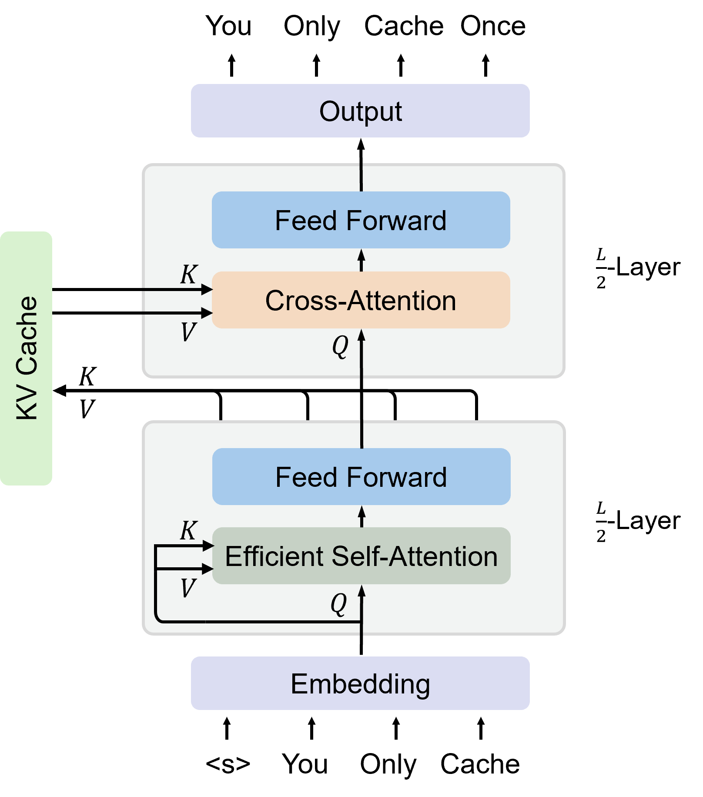
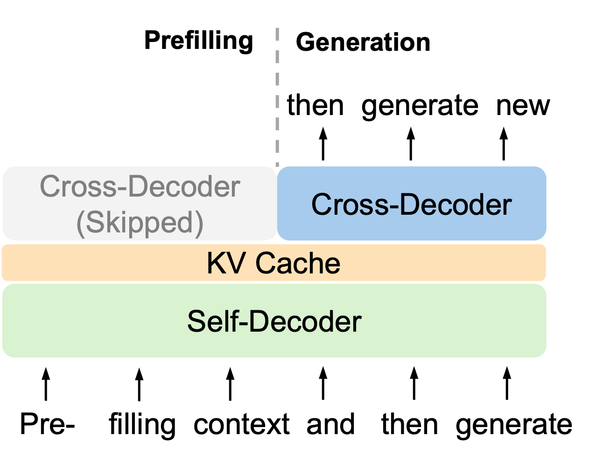
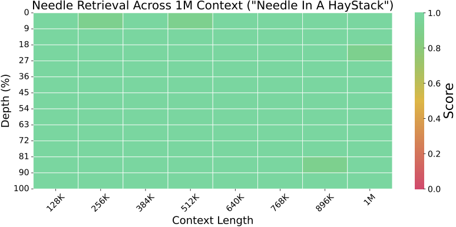

# You Only Cache Once: Decoder-Decoder Architectures for Large Language Models

## Approach
<div align="center">
  
</div>

<div align="center">
  
</div>

## Performance
### Harness Eval
Training with 1T Tokens: 
| **Model**                  | **Arc-c** | **Arc-e** | **BoolQ** | **Hellaswag**$^*$ | **OBQA** | **PIQA** | **Winogrande** | **SciQ** | **Avg** |  
|----------------------------|-----------|-----------|-----------|-------------------|----------|----------|----------------|----------|---------|  
| OpenLLaMA-3B-v2            | 0.339     | 0.676     | 0.657     | **0.700**         | 0.260    | 0.767    | 0.629          | 0.924    | 0.619   |  
| StableLM-base-alpha-3B-v2  | 0.324     | 0.673     | 0.646     | 0.686             | 0.264    | 0.760    | 0.621          | 0.921    | 0.612   |  
| StableLM-3B-4E1T        | ---       | 0.666     | ---       | ---               | ---      | **0.768**| 0.632          | 0.914    | ---     |  
| YOCO-3B                 | **0.379** | **0.731** | 0.645     | 0.689             | **0.298**| 0.763    | 0.639          | 0.924    | **0.634**| 

Training with 1.6T Tokens: 
| **Model**                  | **Arc-c** | **Arc-e** | **BoolQ** | **Hellaswag**$^*$ | **OBQA** | **PIQA** | **Winogrande** | **SciQ** | **Avg** |  
|----------------------------|-----------|-----------|-----------|-------------------|----------|----------|----------------|----------|---------|  
| StableLM-3B-4E1T      | ---       | 0.688     | ---       | ---               | ---      | 0.762    | 0.627          | 0.913    | ---     | 
| YOCO-3B               | 0.396     | 0.733     | **0.644** | 0.698             | 0.300    | 0.764    | 0.631          | 0.921    | 0.636   |  
| YOCO-3B-1M            | **0.413** | **0.747** | 0.638     | **0.705**         | 0.300    | **0.773**| **0.651**      | **0.932**| **0.645**| 
### Needle In A Haystack
<div align="center">
  
</div>

### Multi-Needle Eval
| **Model**               | **Size** | **N=1** | **N=2** | **N=4** | **N=8** |  
|-------------------------|----------|---------|---------|---------|---------|  
| GPT-4-128K              | --       | 1.00    | 1.00    | 0.98    | 1.00    |  
| MiniCPM-128K            | 2.4B     | 1.00    | 1.00    | 0.54    | 0.56    |  
| ChatGLM3-128K           | 6B       | 0.94    | 0.72    | 0.52    | 0.44    |  
| YaRN-Mistral-128K       | 7B       | 0.02    | 0.12    | 0.08    | 0.20    |  
| LWM-1M-text             | 7B       | 1.00    | 0.90    | 0.76    | 0.62    |  
| YOCO-3B-1M              | 3B       | 0.98    | 0.98    | 0.84    | 0.56    |  

## Setup
  
To install the required packages, use the following command:  
  
```bash  
pip install -r requirements.txt
```

Besides normal packages, [Apex](https://github.com/NVIDIA/apex) and [Flash-Attention](https://github.com/Dao-AILab/flash-attention) should be installed seperately following their offcial guidences.

## Harness Eval

To evaluate models in Harness-Eval, the script is as follows in ```scripts/eval_task.sh```:
```bash
cd fairseq/
TASK='harness_boolq'

torchrun --master-port=29505 --nproc_per_node=1 validate.py \
    --data-dir ../harness_data/ \
    --criterion harness_eval \
    --task harness_eval \
    --batch-size 4 \
    --eval-data ${TASK}  \
    --log-format simple  --log-interval 10 \
    --bf16 \
    --tokenizer-pad-to-multiple 8 \
    --arch yoco_3b_new --tiktoken-model cl100k_base --load-ckpt /path_to_ckpt/YOCO-3B-1M/checkpoint.pth --yoco-model /path_to_ckpt/YOCO-3B-1M  --tokens-per-sample 4096
```

## Needle In A Haystack Evaluation
Our model uses city-number pairs for long sequence evaluation. To get the results at a certain maximal length, the script is as follows in ```scripts/eval_needle.sh```:
```bash
cd fairseq/
torchrun --master-port=29504 --nproc_per_node=1 validate.py \
    --task pseudo \
    --criterion needle_haystack \
    --batch-size 1 \
    --max-epoch 1 \
    --no-save \
    --tiktoken-model cl100k_base \
    --bf16 \
    --arch yoco_3b_new --tiktoken-model cl100k_base --load-ckpt /path_to_ckpt/YOCO-3B-1M/checkpoint.pth --yoco-model /path_to_ckpt/YOCO-3B-1M --tokens-per-sample 1048576 --interval 1048576
```

To run Multi-Needle experiments, replace ```--criterion needle_haystack``` with ```--criterion multi_needle --needle-num {num}```.

## Pretraining From Scratch
To support distributed training, our implementation is based on infinibatch to read data iteratively. The overall data directory should be organized as follows:
```
Data/
├── json/
│   ├── train.json
│   └── CC.json
│   └── StarCoder.json
│   └── ...
├── shard/
│   ├── CC/
│   │   ├── 00000.jsonl
│   │   ├── 00001.jsonl
│   │   └── ...
│   └── StarCoder/
│       ├── 00000.jsonl
│       ├── 00001.jsonl
│       └── ...
```

We recommend that each sharded data files contains no more than 10K lines with one json dict per line, and jsonl file, such as ```Data/shard/CC/00000.jsonl```, should be in the format like this:
```json
{"text": "File 1 is here..."}
{"text": "File 2 is here..."}
...
```

Then, for each source, a JSON file preserves all the paths of the jsonl files. Take ```Data/json/CC.json``` for example:
```json
[
    "/path_to_data/Data/shard/CC/00000.jsonl",
    "/path_to_data/Data/shard/CC/00001.jsonl",
    ...
]
```

Finally, ```train.json``` records all sources' information and sampling ratio:
```json
[
    {
        "name": "CC",
        "weight": 0.5
    },
    {
        "name": "StarCoder",
        "weight": 0.2
    },
    ...
]
```

 ```scripts/train.sh```:
```bash
cd fairseq/
torchrun --nproc-per-node=1 train.py /path_to_data \
    --save-interval-updates 5000 \
    --no-epoch-checkpoints \
    --arch yoco_base \
    --criterion cross_entropy \
    --task gpt \
    --tokens-per-sample 2048 \
    --tokenizer-pad-to-multiple 8 \
    --pad-to-max-len \
    --optimizer adam --adam-betas "(0.9, 0.95)" \
    --adam-eps 1e-06 \
    --clip-norm 2.0 \
    --lr 0.00015 \
    --lr-scheduler polynomial_decay \
    --warmup-updates 50 \
    --weight-decay 0.05 \
    --batch-size 1  \
    --model-parallel-size 1 \
    --update-freq 1 \
    --batch-read-ahead 1000 \
    --total-num-update 300000 \
    --log-format simple      --log-interval 10    --disable-validation \
    --tiktoken-model cl100k_base \
    --save-interval-updates 5000 \
    --bf16 # bf16 is encouraged in pre-training
```
