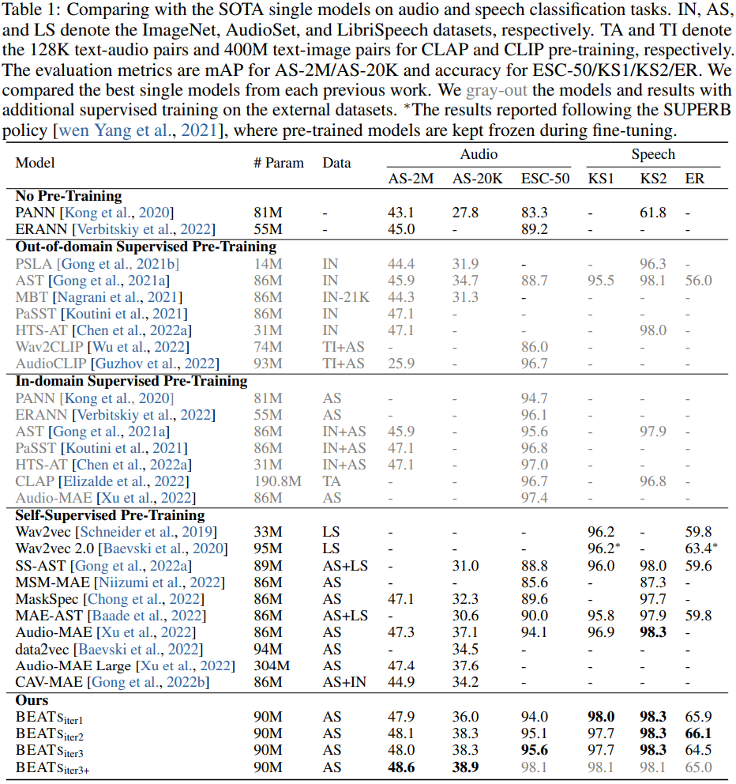
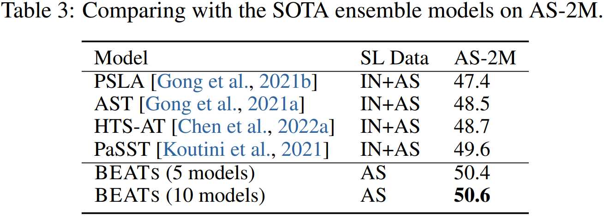
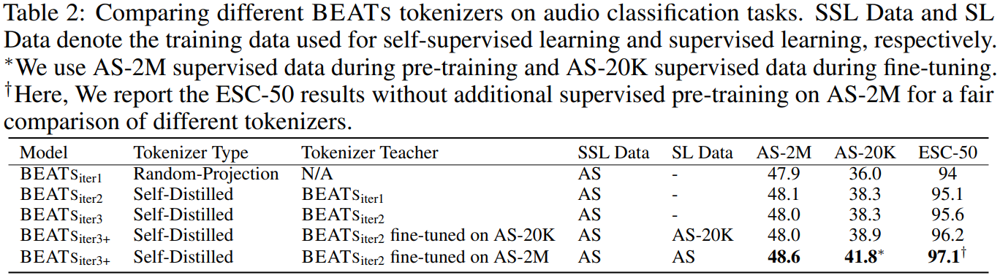
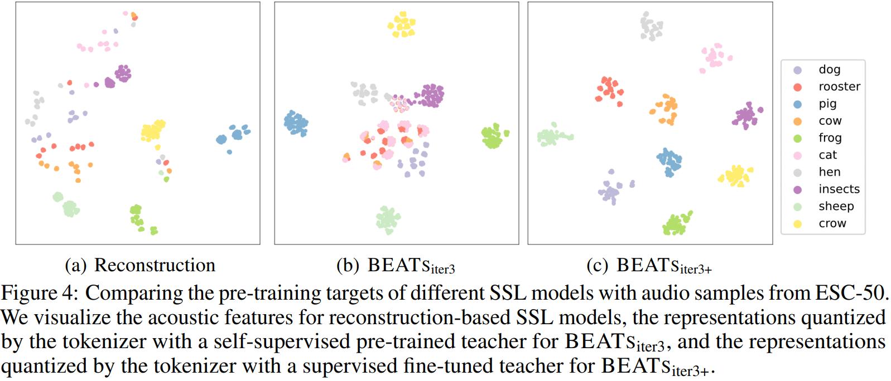

# BEATs

[**BEATs**](https://arxiv.org/abs/2212.09058): **Audio Pre-Training with Acoustic Tokenizers**

Official PyTorch implementation and pretrained models of BEATs

## Pre-Trained and Fine-Tuned Tokenizers and Models
Iterations  | Tokenizer  | Pre-Trained Model | AudioSet Fine-Tuned Model 1 | AudioSet Fine-Tuned Model 2
|---|---|---|---|---
Iter1  |  Random Projection | [BEATs_iter1](https://1drv.ms/u/s!AqeByhGUtINrgcpmY7IHhgc9q0pT7Q?e=uQuisJ)  | [Fine-tuned BEATs_iter1 (cpt1)](https://1drv.ms/u/s!AqeByhGUtINrgcpuRfRZmco2XulmFw?e=f2INHa) | [Fine-tuned BEATs_iter1 (cpt2)](https://1drv.ms/u/s!AqeByhGUtINrgcpyMlTmnRh0Wp_Qgg?e=sgzv8H) | 
Iter2  |  [Tokenizer_iter2](https://1drv.ms/u/s!AqeByhGUtINrgcpnFGsfd_buKng5Pw?e=avWBJw)| [BEATs_iter2](https://1drv.ms/u/s!AqeByhGUtINrgcpwwEGgUyiI-jQyQw?e=1rP1RI)  | [Fine-tuned BEATs_iter2 (cpt1)](https://1drv.ms/u/s!AqeByhGUtINrgcp4l547zKa7xPqy8w?e=rsLdPr) | [Fine-tuned BEATs_iter2 (cpt2)](https://1drv.ms/u/s!AqeByhGUtINrgcp5APbt_2bdIQvX0w?e=2cd2ry) | 
Iter3  |  [Tokenizer_iter3](https://1drv.ms/u/s!AqeByhGUtINrgcp1DEzUBtzHapxcqw?e=JZI5Uf)| [BEATs_iter3](https://1drv.ms/u/s!AqeByhGUtINrgcpxJUNDxg4eU0r-vA?e=qezPJ5)  | [Fine-tuned BEATs_iter3 (cpt1)](https://1drv.ms/u/s!AqeByhGUtINrgcplb48ll1zIt82eWQ?e=XyxrX7) | [Fine-tuned BEATs_iter3 (cpt2)](https://1drv.ms/u/s!AqeByhGUtINrgcptb4S-CeJnlJGtZA?e=2FyDy3) | 
Iter3+  |  [Tokenizer_iter3+ (AS20K)](https://1drv.ms/u/s!AqeByhGUtINrgcpz_SnXxs0SrwHEwA?e=14nugm)| [BEATs_iter3+ (AS20K)](https://1drv.ms/u/s!AqeByhGUtINrgcpvdNz8-aYim60CIg?e=53V8pg)  | [Fine-tuned BEATs_iter3+ (AS20K) (cpt1)](https://1drv.ms/u/s!AqeByhGUtINrgcp2YHUCT1uZx2Kysw?e=nvu1Dw) | [Fine-tuned BEATs_iter3+ (AS20K) (cpt2)](https://1drv.ms/u/s!AqeByhGUtINrgcp092af0h7P3kXKFA?e=kUkPhN) | 
Iter3+  |  [Tokenizer_iter3+ (AS2M)](https://1drv.ms/u/s!AqeByhGUtINrgcppJUDx2TmXiIMFyQ?e=pJsOLl)| [BEATs_iter3+ (AS2M)](https://1drv.ms/u/s!AqeByhGUtINrgcpke6_lRSZEKD5j2Q?e=A3FpOf)  | [Fine-tuned BEATs_iter3+ (AS2M) (cpt1)](https://1drv.ms/u/s!AqeByhGUtINrgcpoZecQbiXeaUjN8A?e=DasbeC) | [Fine-tuned BEATs_iter3+ (AS2M) (cpt2)](https://1drv.ms/u/s!AqeByhGUtINrgcpj8ujXH1YUtxooEg?e=E9Ncea) | 


### Load Tokenizers

```python
import torch
from Tokenizers import TokenizersConfig, Tokenizers

# load the pre-trained checkpoints
checkpoint = torch.load('/path/to/tokenizer.pt')

cfg = TokenizersConfig(checkpoint['cfg'])
BEATs_tokenizer = Tokenizers(cfg)
BEATs_tokenizer.load_state_dict(checkpoint['model'])
BEATs_tokenizer.eval()

# tokenize the audio and generate the labels
audio_input_16khz = torch.randn(1, 10000)
padding_mask = torch.zeros(1, 10000).bool()

labels = BEATs_tokenizer.extract_labels(audio_input_16khz, padding_mask=padding_mask)
```


### Load Pre-Trained Models

```python
import torch
from BEATs import BEATs, BEATsConfig

# load the pre-trained checkpoints
checkpoint = torch.load('/path/to/model.pt')

cfg = BEATsConfig(checkpoint['cfg'])
BEATs_model = BEATs(cfg)
BEATs_model.load_state_dict(checkpoint['model'])
BEATs_model.eval()

# extract the the audio representation
audio_input_16khz = torch.randn(1, 10000)
padding_mask = torch.zeros(1, 10000).bool()

representation = BEATs_model.extract_features(audio_input_16khz, padding_mask=padding_mask)[0]
```


### Load Fine-tuned Models

```python
import torch
from BEATs import BEATs, BEATsConfig

# load the fine-tuned checkpoints
checkpoint = torch.load('/path/to/model.pt')

cfg = BEATsConfig(checkpoint['cfg'])
BEATs_model = BEATs(cfg)
BEATs_model.load_state_dict(checkpoint['model'])
BEATs_model.eval()

# predict the classification probability of each class
audio_input_16khz = torch.randn(3, 10000)
padding_mask = torch.zeros(3, 10000).bool()

probs = BEATs_model.extract_features(audio_input_16khz, padding_mask=padding_mask)[0]

for i, (top5_label_prob, top5_label_idx) in enumerate(zip(*probs.topk(k=5))):
    top5_label = [checkpoint['label_dict'][label_idx.item()] for label_idx in top5_label_idx]
    print(f'Top 5 predicted labels of the {i}th audio are {top5_label} with probability of {top5_label_prob}')
```

## Evaluation Results

### Comparing with the SOTA Single Models



### Comparing with the SOTA Ensemble Models



### Comparing Different BEATS Tokenizers



### Comparing Different Pre-Training Targets



## License
This project is licensed under the license found in the LICENSE file in the root directory of this source tree.
Portions of the source code are based on the [FAIRSEQ](https://github.com/pytorch/fairseq) and [VQGAN](https://github.com/CompVis/taming-transformers) project.

[Microsoft Open Source Code of Conduct](https://opensource.microsoft.com/codeofconduct)


### Reference
If you find our work is useful in your research, please cite the following paper:
``` latex
@article{Chen2022beats,
  title = {BEATs: Audio Pre-Training with Acoustic Tokenizers},
  author  = {Sanyuan Chen and Yu Wu and Chengyi Wang and Shujie Liu and Daniel Tompkins and Zhuo Chen and Furu Wei},
  eprint={2212.09058},
  archivePrefix={arXiv},
  year={2022}
}
```
### Contact Information

For help or issues using BEATs models, please submit a GitHub issue.

For other communications related to  BEATs, please contact Yu Wu (`yuwu1@microsoft.com`).
