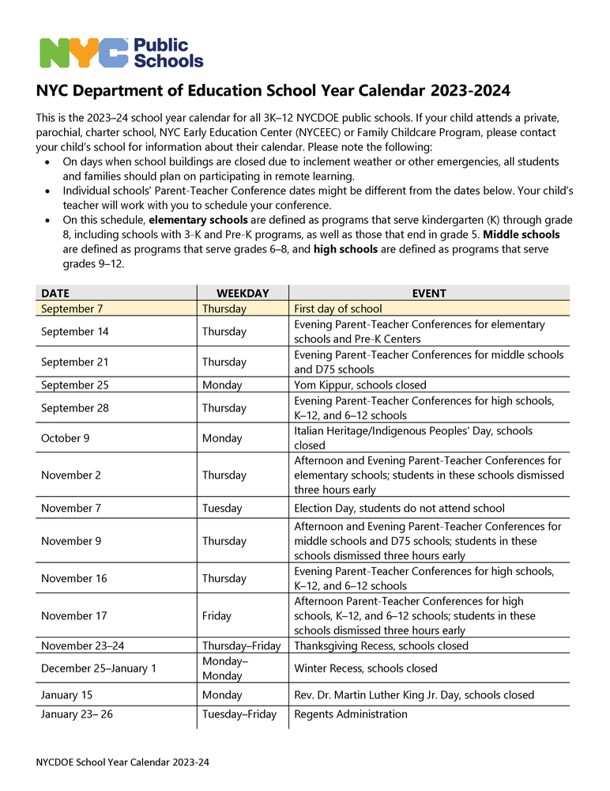
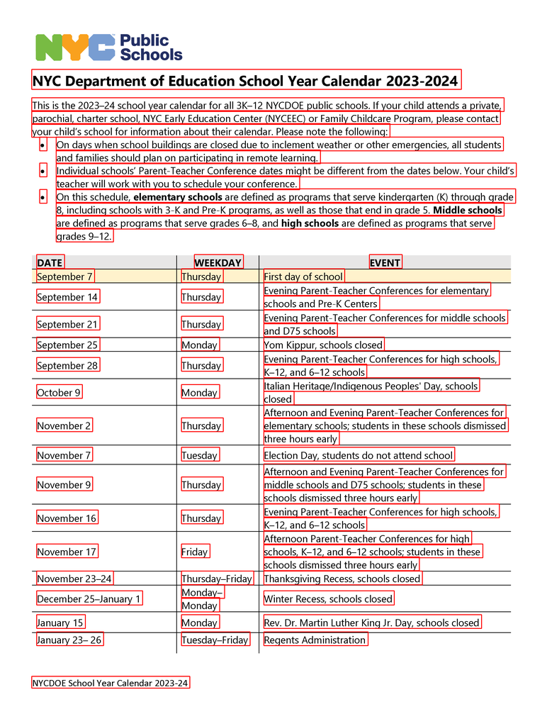
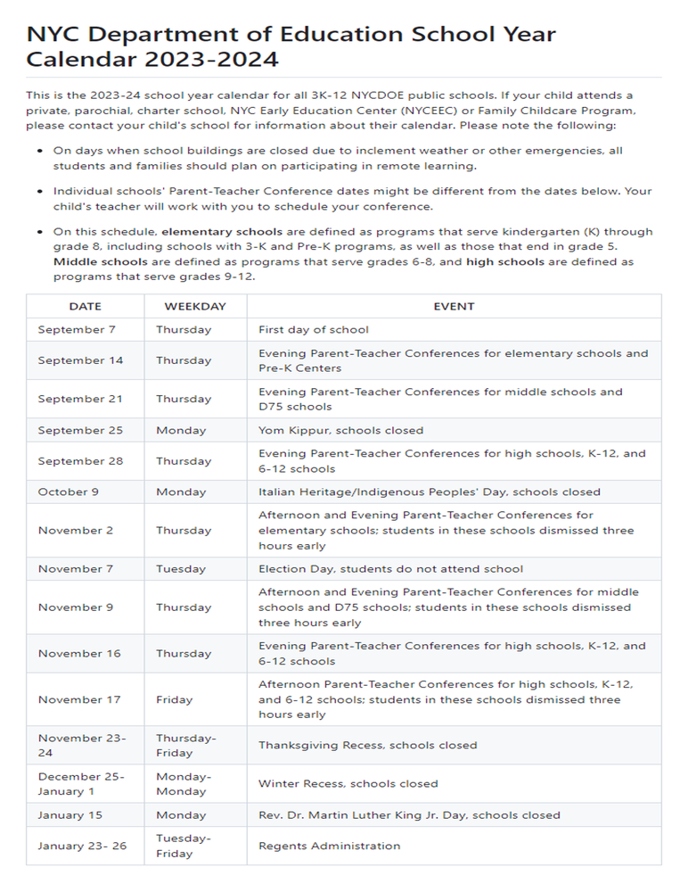

# [Kosmos-2.5: A Multimodal Literate Model](https://arxiv.org/abs/2309.11419)
Kosmos-2.5 is a multimodal literate model for machine reading of text-intensive images. Pre-trained on large-scale text-intensive images, Kosmos-2.5 excels in two distinct yet cooperative transcription tasks: (1) generating spatially-aware text blocks, where each block of text is assigned its spatial coordinates within the image, and (2) producing structured text output that captures styles and structures into the markdown format. This unified multimodal literate capability is achieved through a shared decoder-only auto-regressive Transformer architecture, task-specific prompts, and flexible text representations. We evaluate Kosmos-2.5 on end-to-end document-level text recognition and image-to-markdown text generation. Furthermore, the model can be readily adapted for any text-intensive image understanding task with different prompts through supervised fine-tuning, making it a general-purpose tool for real-world applications involving text-rich images. This work also paves the way for the future scaling of multimodal large language models.

|  |  |  |
|:---------------------------------:|:----------------------------------:|:---------------------------------:|
|       **(a) Input**               |    **(b) Using the ocr prompt** |   **(c) Using the markdown prompt** |

<sub>More model outputs can be found in the "[CASES.md](./CASES.md)"</sub>

## News
- Aug 2024: 🔥We have released **Kosmos-2.5-CHAT**, a model capable of handling Visual Question Answering (VQA) tasks. For more details, please refer to the [model card](https://huggingface.co/microsoft/kosmos-2.5-chat) and [paper](https://arxiv.org/abs/2309.11419).
- Aug 2024: 🔥Kosmos-2.5 will soon be integrated into Hugging Face. Until the official integration, you can use this temporary [repo](https://github.com/tic-top/transformers.git). Please refer to this [link](https://huggingface.co/microsoft/kosmos-2.5) for more information.
- May 2024: We've open-sourced the checkpoint and inference code of Kosmos-2.5, This checkpoint has been trained for more steps than the one reported in the paper.  
- Sep 2023: We release the **Kosmos-2.5: A Multimodal Literate Model** paper. Checkout the [paper](https://arxiv.org/abs/2309.11419).

## Checkpoints
The [checkpoint](https://huggingface.co/microsoft/kosmos-2.5/resolve/main/ckpt.pt?download=true) can be downloaded via:
```bash
wget -O ckpt.pt https://huggingface.co/microsoft/kosmos-2.5/resolve/main/ckpt.pt?download=true
```

## Results
### Text Recognition
| Datasets    |  F1  |  IOU | NED  |
|-------------|:----:|:----:|:----:|
| Handwritten | 71.6 | 94.1 | 90.6 |
| Design      | 61.7 | 80.2 | 79.6 |
| Receipt     | 89.4 | 80.1 | 83.3 |
| General     | 97.6 | 89.8 | 93.9 |
| Academic    | 98.8 | 93.3 | 99.1 |
| Web Image   | 57.0 | 72.1 | 69.6 |

### Image to Markdown
| Datasets      | NED  | NTED |
|---------------|:----:|:----:|
| Docx          | 91.6 | 82.1 |
| README        | 95.1 | 91.2 |
| Arxiv         | 90.8 | 86.4 |
| Tables        | 85.1 | 90.1 |
| Math Equation | 88.1 | 95.2 |
| CROHME Math   | 98.5 | 99.7 |

### Document Reading
| Datasets        | DocVQA | InfoVQA | DeepForm | KLC | WTQ | TabFact | ChartQA | TextVQA | VisualMRC |
|-----------------|:------:|:-------:|:--------:|:---:|:---:|:-------:|:-------:|:-------:|:---------:|
| Kosmos-2.5-CHAT |  81.1  |  41.3   |   65.8   |35.1 |32.4 | 49.9    | 62.3    | 40.7    | 156.0     | 

## Installation
The code uses [Flash Attention2](https://github.com/Dao-AILab/flash-attention), so it only runs on Ampere, Ada, or Hopper GPUs (e.g., A100, RTX 3090, RTX 4090, H100).
``` bash
git clone https://github.com/microsoft/unilm.git
cd unilm/kosmos-2.5
pip install -r requirements.txt
```

## Inference

  ``` bash
  python inference.py \
    --do_ocr \                      // --do_md for image2md task
    --image path/to/image \
    --ckpt path/to/checkpoint \ 
  ```
For images with extreme aspect ratios, we recommend resizing images to a more typical aspect ratio for better performance with the following command:
  ``` bash
  python inference.py \
    --do_ocr \                      // --do_md for image2md task
    --image path/to/image \
    --ckpt path/to/checkpoint \
    --use_preprocess \
    --hw_ratio_adj_upper_span "[1.5, 5]" \
    --hw_ratio_adj_lower_span "[0.5, 1.0]" 
  ```
  Please adjust the parameters based on your use cases. For example,
  - `--hw_ratio_adj_upper_span "[1.5, 5]"` indicates that if the image's aspect ratio is between 1.5 and 5, the image will be resized to an aspect ratio of 1.5. 
  - `--hw_ratio_adj_lower_span "[0.5, 1.0]"` indicates that if the image's aspect ratio is between 0.5 and 1.0, the image will be resized to an aspect ratio of 1.0.
  
  

## NOTE:
Since this is a generative model, there is a risk of **hallucination** during the generation process, and it **CAN NOT** guarantee the accuracy of all OCR/Markdown results in the images.

## Citation

If you find this repository useful, please consider citing our work:
```
@article{lv2023kosmos,
  title={Kosmos-2.5: A multimodal literate model},
  author={Lv, Tengchao and Huang, Yupan and Chen, Jingye and Cui, Lei and Ma, Shuming and Chang, Yaoyao and Huang, Shaohan and Wang, Wenhui and Dong, Li and Luo, Weiyao and others},
  journal={arXiv preprint arXiv:2309.11419},
  year={2023}
}
```


## License
The content of this project itself is licensed under the [MIT](./LICENSE)

[Microsoft Open Source Code of Conduct](https://opensource.microsoft.com/codeofconduct)


## Contact
For help or issues using Kosmos-2.5, please submit a GitHub issue.

For other communications related to Kosmos-2.5, please contact [Lei Cui](mailto:lecu@microsoft.com) or [Furu Wei](mailto:fuwei@microsoft.com).
