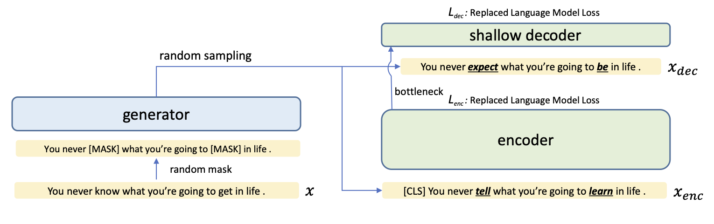
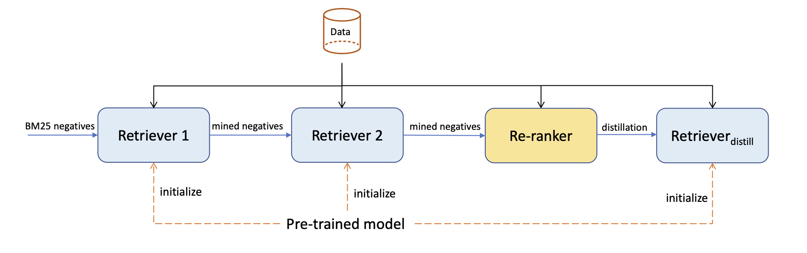

# SimLM: Pre-training for Similarity Matching

- January 2023: release code
- July 2022: release preprint [SimLM: Pre-training with Representation Bottleneck for Dense Passage Retrieval](https://arxiv.org/abs/2207.02578)

SimLM is a retrieval-oriented pre-training architecture,
which aims to compress input information into a representation bottleneck 
with replaced language modeling objective.



After pre-training,
we use a four-stage supervised fine-tuning pipeline to train state-of-the-art dense retrievers.



## Available models

| Model                       | Short description                                    |
|-----------------------------|------------------------------------------------------|
| [intfloat/simlm-base-msmarco](https://huggingface.co/intfloat/simlm-base-msmarco) | SimLM pre-trained on MS-MARCO passage corpus         |
| [intfloat/simlm-base-msmarco-finetuned](https://huggingface.co/intfloat/simlm-base-msmarco-finetuned) | Fine-tuned SimLM with distillation on MS-MARCO       |
| [intfloat/simlm-msmarco-reranker](https://huggingface.co/intfloat/simlm-msmarco-reranker)  | Cross-encoder re-ranker on MS-MARCO                  |
| [intfloat/simlm-base-wiki100w](https://huggingface.co/intfloat/simlm-base-wiki100w)  | SimLM pre-trained on [DPR](https://github.com/facebookresearch/DPR)-version Wikipedia passage corpus |

All the models can be loaded with [Huggingface transformers](https://github.com/huggingface/transformers) API:

```python
from transformers import AutoModel, AutoTokenizer

model = AutoModel.from_pretrained('intfloat/simlm-base-msmarco-finetuned')
tokenizer = AutoTokenizer.from_pretrained('intfloat/simlm-base-msmarco-finetuned')
```

## Requirements

The main dependencies are as follows:

```
python>=3.7
transformers==4.15
datasets==2.0.0
torch>=1.7
deepspeed==0.6.0
pytrec_eval
```

Run the following command to install the required packages:

```shell
pip install -r requirements.txt
```

## Download our pre-processed data

The following script will download our pre-processed data for [MS-MARCO passage ranking](https://microsoft.github.io/msmarco/) task.

```shell
bash scripts/download_msmarco_data.sh
```

## Reproduce SimLM results for MS-MARCO passage ranking

First,
please make sure you have downloaded our pre-processed data.

### Evaluate our fine-tuned biencoder retriever

```shell
export DATA_DIR=./data/msmarco_bm25_official/
export OUTPUT_DIR=./tmp/

# Encode all the corpus passages
bash scripts/encode_marco.sh intfloat/simlm-base-msmarco-finetuned

# Perform nearest-neighbor search for queries
bash scripts/search_marco.sh intfloat/simlm-base-msmarco-finetuned dev
bash scripts/search_marco.sh intfloat/simlm-base-msmarco-finetuned trec_dl2019
bash scripts/search_marco.sh intfloat/simlm-base-msmarco-finetuned trec_dl2020
```

Expected results:

| dev MRR@10 | dev R@50  | dev R@1k  |  TREC DL 2019 nDCG@10 | TREC DL 2020 nDCG@10  |
|--|---|---|---|---|
| 41.1 |  87.8 | 98.7  | 71.4 | 69.7 |

### Evaluate our released cross-encoder re-ranker

```shell
export DATA_DIR=./data/msmarco_reranker/
export OUTPUT_DIR=./tmp/

bash scripts/rerank_marco.sh intfloat/simlm-msmarco-reranker $DATA_DIR/dev.msmarco.txt dev
bash scripts/rerank_marco.sh intfloat/simlm-msmarco-reranker $DATA_DIR/trec_dl2019.msmarco.txt trec_dl2019
bash scripts/rerank_marco.sh intfloat/simlm-msmarco-reranker $DATA_DIR/trec_dl2020.msmarco.txt trec_dl2020
# Will not compute metrics since test labels are not available
bash scripts/rerank_marco.sh intfloat/simlm-msmarco-reranker $DATA_DIR/test.msmarco.txt test
```

Expected results:

| dev MRR@10 | dev R@50  | dev R@1k  |  TREC DL 2019 nDCG@10 | TREC DL 2020 nDCG@10  |
|--|---|---|---|---|
| 43.8 |  89.2 | 98.6  | 74.6 | 72.7 |

### Train a biencoder retriever with BM25 hard negatives

GPU requirements: 4 V100 GPUs (32GB)

```shell
export DATA_DIR=./data/msmarco_bm25_official/
export OUTPUT_DIR=./checkpoint/biencoder/

# Train bi-encoder
bash scripts/train_biencoder_marco.sh

# Encode corpus passages
bash scripts/encode_marco.sh $OUTPUT_DIR

# Evaluate on each split
bash scripts/search_marco.sh $OUTPUT_DIR dev
bash scripts/search_marco.sh $OUTPUT_DIR trec_dl2019
bash scripts/search_marco.sh $OUTPUT_DIR trec_dl2020
bash scripts/search_marco.sh $OUTPUT_DIR test

# Predictions for training datasets can be used as mined hard negatives
bash scripts/search_marco.sh $OUTPUT_DIR train
```

Expected results:

| dev MRR@10 | dev R@50  | dev R@1k  |
|--|---|---|
| 38.0 |  85.8 | 98.3 |

### Train a biencoder retriever with knowledge distillation

GPU requirements: 4 V100 GPUs (32GB)

```shell
export DATA_DIR=./data/msmarco_distillation/
export OUTPUT_DIR=./checkpoint/distilled_biencoder/

# Train bi-encoder with knowledge distillation
bash scripts/train_kd_biencoder.sh

# Encode corpus passages
bash scripts/encode_marco.sh $OUTPUT_DIR

# Evaluate on each split
bash scripts/search_marco.sh $OUTPUT_DIR dev
bash scripts/search_marco.sh $OUTPUT_DIR trec_dl2019
bash scripts/search_marco.sh $OUTPUT_DIR trec_dl2020
bash scripts/search_marco.sh $OUTPUT_DIR test
```

The results are expected to be close to `intfloat/simlm-base-msmarco-finetuned`.

### Train a cross-encoder re-ranker

GPU requirements: 8 V100 GPUs (32GB)

```shell
export DATA_DIR=./data/msmarco_reranker/
export OUTPUT_DIR=./checkpoint/cross_encoder_reranker/

# Train cross-encoder re-ranker
bash scripts/train_reranker_marco.sh

# Re-rank top-200 outputs by biencoder retrievers
bash scripts/rerank_marco.sh $OUTPUT_DIR $DATA_DIR/dev.msmarco.txt
bash scripts/rerank_marco.sh $OUTPUT_DIR $DATA_DIR/trec_dl2019.msmarco.txt trec_dl2019
bash scripts/rerank_marco.sh $OUTPUT_DIR $DATA_DIR/trec_dl2020.msmarco.txt trec_dl2020
bash scripts/rerank_marco.sh $OUTPUT_DIR $DATA_DIR/test.msmarco.txt test
```

The results are expected to be close to `intfloat/simlm-msmarco-reranker`.

### Pre-train SimLM with target corpus

GPU requirements: 8 V100 GPUs (at least 16GB)

```shell
export DATA_DIR=./data/msmarco_bm25_official/
export OUTPUT_DIR=./checkpoint/replaced_lm/

bash ./scripts/train_rlm.sh
```

After SimLM pre-training,
follow the supervised fine-tuning instructions to evaluate the model's quality.

## Frequently asked questions

1. Do I have to use DeepSpeed launcher?

We highly recommend using [DeepSpeed](https://github.com/microsoft/DeepSpeed) to launch training jobs.
DeepSpeed enables faster training speed and lower GPU memory usage.
If DeepSpeed does not work for you,
you can switch to pytorch launcher by making following changes to the shell script:

```shell
# Uncomment this line to use pytorch launcher and delete the deepspeed command
python -u -m torch.distributed.launch --nproc_per_node 4 src/train_biencoder.py \
# deepspeed src/train_biencoder.py --deepspeed ds_config.json
```

2. Where does the title field in MS-MARCO passage dataset come from?

The title data comes from [RocketQA](https://github.com/PaddlePaddle/RocketQA),
which is also used for training by [coCondenser](https://arxiv.org/abs/2108.05540).

For any other questions,
please open a GitHub issue or contact Liang Wang (wangliang@microsoft.com).

## Acknowledgments

Part of the code is based on [Tevatron](https://github.com/texttron/tevatron).

## Citation

If you find our paper or code helpful,
please consider citing as follows:

```bibtex
@article{Wang2022SimLMPW,
  title={SimLM: Pre-training with Representation Bottleneck for Dense Passage Retrieval},
  author={Liang Wang and Nan Yang and Xiaolong Huang and Binxing Jiao and Linjun Yang and Daxin Jiang and Rangan Majumder and Furu Wei},
  journal={ArXiv},
  year={2022},
  volume={abs/2207.02578}
}
```

## License

This project is licensed under the license found in the LICENSE file in the root directory of this source tree.
[Microsoft Open Source Code of Conduct](https://opensource.microsoft.com/codeofconduct)
