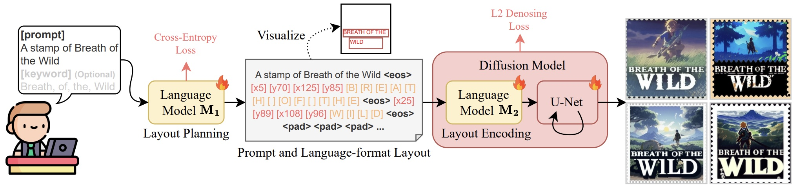
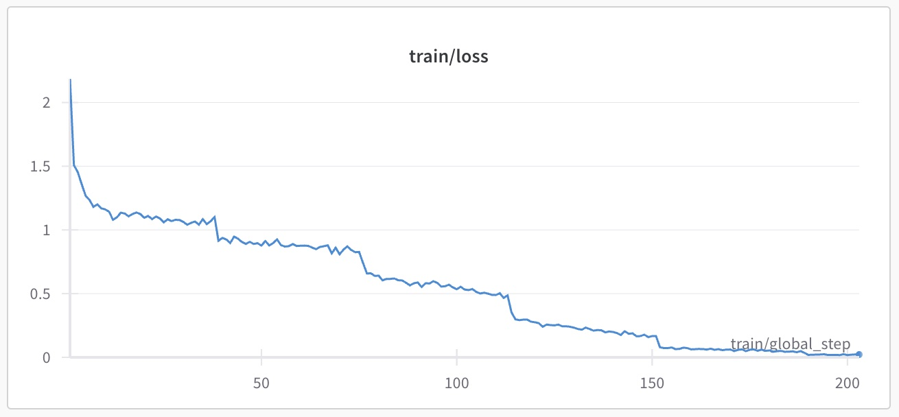
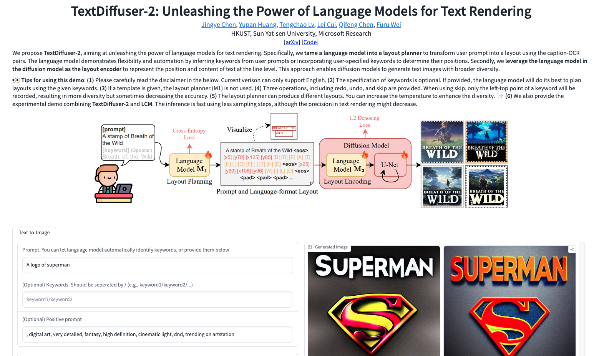

# TextDiffuser-2: Unleashing the Power of Language Models for Text Rendering

<a href='https://arxiv.org/abs/2311.16465'></a>
<a href='https://github.com/microsoft/unilm/tree/master/textdiffuser-2'></a>
<a href='https://jingyechen.github.io/textdiffuser2/'></a>
[](https://huggingface.co/spaces/JingyeChen22/TextDiffuser-2)
<a href='https://discord.gg/HVEcfcwdHv'></a>
[](https://replicate.com/cjwbw/textdiffuser-2) 


TextDiffuser-2 exhibits enhanced capability powered by language models. In addition to generating text with remarkable accuracy, TextDiffuser-2 provides plausible text layouts and demonstrates a diverse range of text styles.



## :star2:	Highlights

* We propose **TextDiffuser-2** which utilizes two language models for layout planning and layout encoding, increasing the flexibility and diversity in the process of text rendering. 

* **TextDiffuser-2** alleivate several drawbacks in previous methods, such as (1) *limited flexibility and automation*, (2) *constrained capability of layout prediction*, and (3) *Restricted style diversity*.

* **TextDiffuser-2** is capable of handling text-to-image, text-to-image with template, and text inpainting tasks. Moreover, TextDiffuser-2 introduces *an additional feature* - it allows for the editing of generated layouts in a conversational manner.

* ✨ We **release the demo** at [link](https://huggingface.co/spaces/JingyeChen22/TextDiffuser-2). Welcome to use and provide feedbacks.


## :stopwatch: News

- __[2023.12.26]__: Code, model, and demo for the text inpainting task are all released. Welcome to play with it at [link](https://huggingface.co/spaces/JingyeChen22/TextDiffuser-2-Text-Inpainting).

- __[2023.12.12]__: The training and inference code for text-to-image is released. We provide the code for full-parameter training and lora training.

- __[2023.12.10]__: The demo is released at [link](https://huggingface.co/spaces/JingyeChen22/TextDiffuser-2).

- __[2023.11.20]__: The paper is available at [link](https://arxiv.org/pdf/2311.16465.pdf).


## :hammer_and_wrench: Installation

Clone this repo: 
```
git clone https://github.com/microsoft/unilm/
cd unilm/tree/master/textdiffuser-2
```

Build up a new environment and install packages as follows:
```
conda create -n textdiffuser2 python=3.8
conda activate textdiffuser2
pip install -r requirements.txt
```

Meanwhile, please install **torch**, **torchvision**, **xformers** that matches the version of system and cuda version (refer to this [link](https://download.pytorch.org/whl/torch_stable.html)). Please also install [flash-attention](https://github.com/Dao-AILab/flash-attention) if you want to train the layout planner using [FastChat](https://github.com/lm-sys/FastChat). We provide the list of packages used in the experiments at [link](./assets/reference_requirements.txt) for your reference.

For training the **text inpainting task**, please install the diffusers package using the command ```pip install https://github.com/JingyeChen/diffusers_td2.git```. Note that the U-Net architecture has been modified for receiving more input features.

<small> If you encounterd an error of *RuntimeError: expected scalar type float Float bu found Half* trigged by *diffusers/models/attention_processor.py*, please use [attention_processor.py](./assets/attention_processor.py) to replace the corresponding file in the installed diffusers library. </small>

## :floppy_disk: Checkpoint

We upload the checkpoints to HuggingFace🤗. 

* The checkpoint of layout planner is at [link](https://huggingface.co/JingyeChen22/textdiffuser2_layout_planner). 
* The checkpoint of diffusion model (full parameter fine-tuning) is at [link](https://huggingface.co/JingyeChen22/textdiffuser2-full-ft).
* The checkpoint of diffusion model (lora fine-tuning) is at [link](https://huggingface.co/JingyeChen22/textdiffuser2-lora-ft).

Note that we provide the checkpoint with context length 77 as it performs better results when rendering general objects.

## :books: Dataset

The data for training the layout planner is at [link](./data/layout_planner_data_5k.json).

We employ the MARIO-10M dataset for training TextDiffuser-2. Please follow the **Dataset** section at [TextDiffuser](https://github.com/microsoft/unilm/tree/master/textdiffuser) to download the dataset, inluding the **train_dataset_index_file**.

The train_dataset_index_file should be a .txt file, and each line should indicate an index of a training sample.
 
```txt
06269_062690093
27197_271975251
27197_271978467
...
```

## :steam_locomotive: Train

### Train layout planner

```bash
CUDA_VISIBLE_DEVICES=0,1,2,3,4,5,6,7 torchrun --nproc_per_node=8 --master_port=20003 fastchat/train/train_mem.py \
    --model_name_or_path lmsys/vicuna-7b-v1.5  \
    --data_path data/layout_planner_data_5k.json \
    --bf16 True \
    --output_dir experiment_result \
    --num_train_epochs 6 \
    --per_device_train_batch_size 2 \
    --per_device_eval_batch_size 2 \
    --gradient_accumulation_steps 16 \
    --evaluation_strategy "no" \
    --save_strategy "steps" \
    --save_steps 500 \
    --save_total_limit 5 \
    --learning_rate 2e-5 \
    --weight_decay 0. \
    --warmup_ratio 0.03 \
    --lr_scheduler_type "cosine" \
    --logging_steps 1 \
    --fsdp "full_shard auto_wrap" \
    --fsdp_transformer_layer_cls_to_wrap 'LlamaDecoderLayer' \
    --tf32 True \
    --model_max_length 2048 \
    --gradient_checkpointing True \
    --lazy_preprocess True
```

It is normal that the loss curve seems like a staircase:


### Train diffusion model

For full-parameter training:
```bash
accelerate launch train_textdiffuser2_t2i_full.py \
    --pretrained_model_name_or_path="runwayml/stable-diffusion-v1-5" \
    --train_batch_size=18 \
    --gradient_accumulation_steps=4 \
    --gradient_checkpointing \
    --mixed_precision="fp16" \
    --num_train_epochs=6 \
    --learning_rate=1e-5 \
    --max_grad_norm=1 \
    --lr_scheduler="constant" \
    --lr_warmup_steps=0 \
    --output_dir="diffusion_experiment_result" \
    --enable_xformers_memory_efficient_attention \
    --dataloader_num_workers=8 \
    --index_file_path='/path/to/train_dataset_index.txt' \
    --dataset_path='/path/to/laion-ocr-select/' \
    --granularity=128 \
    --coord_mode="ltrb" \
    --max_length=77 \
    --resume_from_checkpoint="latest"
```

For LoRA training:
```bash
accelerate launch train_textdiffuser2_t2i_lora.py \
    --pretrained_model_name_or_path="runwayml/stable-diffusion-v1-5" \
    --train_batch_size=18 \
    --gradient_accumulation_steps=4 \
    --gradient_checkpointing \
    --mixed_precision="fp16" \
    --num_train_epochs=6 \
    --learning_rate=1e-4 \
    --text_encoder_learning_rate=1e-5 \
    --lr_scheduler="constant" \
    --output_dir="diffusion_experiment_result" \
    --enable_xformers_memory_efficient_attention \
    --dataloader_num_workers=8 \
    --index_file_path='/path/to/train_dataset_index.txt' \
    --dataset_path='/path/to/laion-ocr-select/' \
    --granularity=128 \
    --coord_mode="ltrb" \
    --max_length=77 \
    --resume_from_checkpoint="latest"
```

If you encounter an "out-of-memory" error, please consider reducing the batch size appropriately.
 
## :firecracker: Inference

For full-parameter inference:
```bash
accelerate launch inference_textdiffuser2_t2i_full.py \
  --pretrained_model_name_or_path="runwayml/stable-diffusion-v1-5" \
  --mixed_precision="fp16" \
  --output_dir="inference_results" \
  --enable_xformers_memory_efficient_attention \
  --resume_from_checkpoint="JingyeChen22/textdiffuser2-full-ft" \
  --granularity=128 \
  --max_length=77 \
  --coord_mode="ltrb" \
  --cfg=7.5 \
  --sample_steps=20 \
  --seed=43555 \
  --m1_model_path="JingyeChen22/textdiffuser2_layout_planner" \
  --input_format='prompt' \
  --input_prompt='a hotdog with mustard and other toppings on it'
```

For LoRA inference:
```bash
accelerate launch inference_textdiffuser2_t2i_lora.py \
  --pretrained_model_name_or_path="runwayml/stable-diffusion-v1-5" \
  --gradient_accumulation_steps=4 \
  --gradient_checkpointing \
  --mixed_precision="fp16" \
  --output_dir="inference_results" \
  --enable_xformers_memory_efficient_attention \
  --resume_from_checkpoint="JingyeChen22/textdiffuser2-lora-ft" \
  --granularity=128 \
  --coord_mode="ltrb" \
  --cfg=7.5 \
  --sample_steps=50 \
  --seed=43555 \
  --m1_model_path="JingyeChen22/textdiffuser2_layout_planner" \
  --input_format='prompt' \
  --input_prompt='a stamp of u.s.a'
```

## :joystick:	Demo
TextDiffuser-2 has been deployed on [Hugging Face](https://huggingface.co/spaces/JingyeChen22/TextDiffuser-2). Welcome to play with it! You can also run ```python gradio_demo.py``` to use the demo locally.




## :love_letter: Acknowledgement

We sincerely thank [AK](https://huggingface.co/akhaliq) and [hysts](https://huggingface.co/hysts) for helping set up the demo. We also feel thankful for the available code/api/demo of [SDXL](https://huggingface.co/stabilityai/stable-diffusion-xl-base-1.0), [PixArt](https://pixart-alpha.github.io/), [Ideogram](https://ideogram.ai/), [DALLE-3](https://openai.com/dall-e-3), and [GlyphControl](https://huggingface.co/spaces/AIGText/GlyphControl).

  
## :exclamation: Disclaimer
Please note that the code is intended for academic and research purposes **ONLY**. Any use of the code for generating inappropriate content is **strictly prohibited**. The responsibility for any misuse or inappropriate use of the code lies solely with the users who generated such content, and this code shall not be held liable for any such use.

## :envelope: Contact

For help or issues using TextDiffuser-2, please email Jingye Chen (qwerty.chen@connect.ust.hk), Yupan Huang (huangyp28@mail2.sysu.edu.cn) or submit a GitHub issue.

For other communications related to TextDiffuser-2, please contact Lei Cui (lecu@microsoft.com) or Furu Wei (fuwei@microsoft.com).

## :herb: Citation
If you find TextDiffuser-2 useful in your research, please consider citing:
```
@article{chen2023textdiffuser,
  title={TextDiffuser-2: Unleashing the Power of Language Models for Text Rendering},
  author={Chen, Jingye and Huang, Yupan and Lv, Tengchao and Cui, Lei and Chen, Qifeng and Wei, Furu},
  journal={arXiv preprint arXiv:2311.16465},
  year={2023}
}
```
