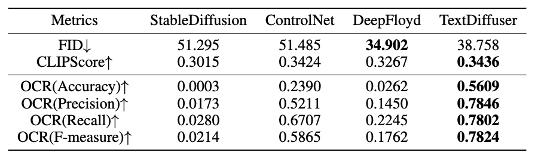

# TextDiffuser: Diffusion Models as Text Painters

<a href='https://arxiv.org/pdf/2305.10855.pdf'>
<a href='https://github.com/microsoft/unilm/tree/master/textdiffuser'>
<a href='https://jingyechen.github.io/textdiffuser/'>
</a> [](https://huggingface.co/spaces/JingyeChen22/TextDiffuser)


TextDiffuser generates images with visually appealing text that is coherent with backgrounds. It is flexible and controllable to create high-quality text images using text prompts alone or together with text template images, and conduct text inpainting to reconstruct incomplete images with text.


## :star2:	Highlights

* We propose **TextDiffuser**, which is a two-stage diffusion-based framework for text rendering. It generates accurate and coherent text images from text prompts or additionally with template images, as well as conducting text inpainting to reconstruct incomplete images.

* We release **MARIO-10M**, containing large-scale image-text pairs with OCR annotations, including text recognition, detection, and character-level segmentation masks. (To be released)

* We construct **MARIO-Eval**, a comprehensive text rendering benchmark containing 10k prompts.

* We **release the demo** at [link](https://huggingface.co/spaces/JingyeChen22/TextDiffuser). Welcome to use and provide feedbacks :hugs:.

## :stopwatch: News

- __[2023.06.02]__: :raised_hands:	:raised_hands:	:raised_hands:	Demo is available in this [link](https://huggingface.co/spaces/microsoft/TextDiffuser).
- __[2023.05.26]__: Upload the inference code and checkpoint.

## :hammer_and_wrench: Installation

Clone this repo: 
```
git clone github_path_to/TextDiffuser
cd TextDiffuser
```

Build up a new environment and install packages as follows:
```
conda create -n textdiffuser python=3.8
conda activate textdiffuser
pip install -r requirements.txt
```

Meanwhile, please install torch and torchvision that matches the version of system and cuda (refer to this [link](https://download.pytorch.org/whl/torch_stable.html)). 


Install Hugging Face Diffuser and replace some files:
```
git clone https://github.com/huggingface/diffusers
cp ./assets/files/scheduling_ddpm.py ./diffusers/src/diffusers/schedulers/scheduling_ddpm.py
cp ./assets/files/unet_2d_condition.py ./diffusers/src/diffusers/models/unet_2d_condition.py
cp ./assets/files/modeling_utils.py ./diffusers/src/diffusers/models/modeling_utils.py
cd diffusers && pip install -e .
```

Besides, a font file is needed for layout generation. Please put your font in ```assets/font/```. We recommend to use ```Arial.ttf```.


## :floppy_disk: Checkpoint

The checkpoints are in this [link](https://layoutlm.blob.core.windows.net/textdiffuser/textdiffuser-ckpt.zip) (9.0GB). Please download it using ```wget``` and unzip it. The file structures should be as follows:

```
textdiffuser
├── textdiffuser-ckpt
│   ├── diffusion_backbone/              # for diffusion backbone
│   ├── character_aware_loss_unet.pth   # for character-aware loss
│   ├── layout_transformer.pth          # for layout transformer
│   └── text_segmenter.pth              # for character-level segmenter
├── README.md
```

## :firecracker: Inference

TextDiffuser can be applied on: text-to-image, text-to-image-with-template, and text-inpainting.

### Text-to-Image
This task is designed to generate images based on given prompts. Users are required to enclose the keywords to be drawn with single quotation marks.

```bash
CUDA_VISIBLE_DEVICES=0 python inference.py \
  --mode="text-to-image" \
  --resume_from_checkpoint="textdiffuser-ckpt/diffusion_backbone" \
  --prompt="A sign that says 'Hello'" \
  --output_dir="./output" \
  --vis_num=4
```

### Text-to-Image-with-Template
This task aims to generate images based on given prompts and template images (can be printed, handwritten, or scene text images). A pre-trained character-level segmentation model is used to extract layout information from the template image.

```bash
CUDA_VISIBLE_DEVICES=0 python inference.py \
  --mode="text-to-image-with-template" \
  --resume_from_checkpoint="textdiffuser-ckpt/diffusion_backbone" \
  --prompt="a poster of monkey music festival" \
  --template_image="assets/examples/text-to-image-with-template/case2.jpg" \
  --output_dir="./output" \
  --vis_num=4
```

### Text-Inpainting
This task aims to modify a given image in an inpainting manner. The provided text mask image should contain the inpainting region and the text to be drawn within the region.

```bash
CUDA_VISIBLE_DEVICES=0 python inference.py \
  --mode="text-inpainting" \
  --resume_from_checkpoint="textdiffuser-ckpt/diffusion_backbone" \
  --prompt="a boy draws good morning on a board" \
  --original_image="assets/examples/text-inpainting/case2.jpg" \
  --text_mask="assets/examples/text-inpainting/case2_mask.jpg" \
  --output_dir="./output" \
  --vis_num=4
```

## :chart_with_upwards_trend:	Experimental Results



The performance of text-to-image on MARIO-Eval compared with existing methods. TextDiffuser performs
the best regarding CLIPScore and OCR evaluation while achieving comparable performance on FID.


User studies for whole-image generation and part-image generation tasks. (a) For whole-image generation, our method clearly outperforms others in both aspects of text rendering quality and image-text matching. (b) For part-image generation, our method receives high scores from human evaluators in these two aspects.


## :joystick:	Demo
TextDiffuser has been deployed on [Hugging Face](https://huggingface.co/spaces/microsoft/TextDiffuser). If you have advanced GPUs, you may deploy the demo locally as follows:

```python
CUDA_VISIBLE_DEVICES=0 python gradio_app.py
```

Then you can enjoy the demo with local browser:  


## :framed_picture:	Gallery

### Text-to-Image


### Text-to-Image-with-Template


### Text-Inpainting


## :love_letter: Acknowledgement

We sincerely thank the following projects: [Hugging Face Diffuser](https://github.com/huggingface/diffusers), [LAION](https://laion.ai/laion-400-open-dataset/), [DB](https://github.com/MhLiao/DB), [PARSeq](https://github.com/baudm/parseq), [img2dataset](https://github.com/rom1504/img2dataset).

Also, special thanks to the open-source diffusion project or available demo: [DALLE](https://openai.com/product/dall-e-2), [Stable Diffusion](https://github.com/CompVis/stable-diffusion), [Stable Diffusion XL](https://dreamstudio.ai/generate), [Midjourney](https://www.midjourney.com/home/?callbackUrl=%2Fapp%2F), [ControlNet](https://github.com/lllyasviel/ControlNet), [DeepFloyd](https://github.com/deep-floyd/IF).


## :envelope: Contact

For help or issues using TextDiffuser, please email Jingye Chen (qwerty.chen@connect.ust.hk), Yupan Huang (huangyp28@mail2.sysu.edu.cn) or submit a GitHub issue.

For other communications related to TextDiffuser, please contact Lei Cui (lecu@microsoft.com) or Furu Wei (fuwei@microsoft.com).

## :herb: Citation
If you find this code useful in your research, please consider citing:
```
@article{chen2023textdiffuser,
  title={TextDiffuser: Diffusion Models as Text Painters},
  author={Chen, Jingye and Huang, Yupan and Lv, Tengchao and Cui, Lei and Chen, Qifeng and Wei, Furu},
  journal={arXiv preprint arXiv:2305.10855},
  year={2023}
}
```
