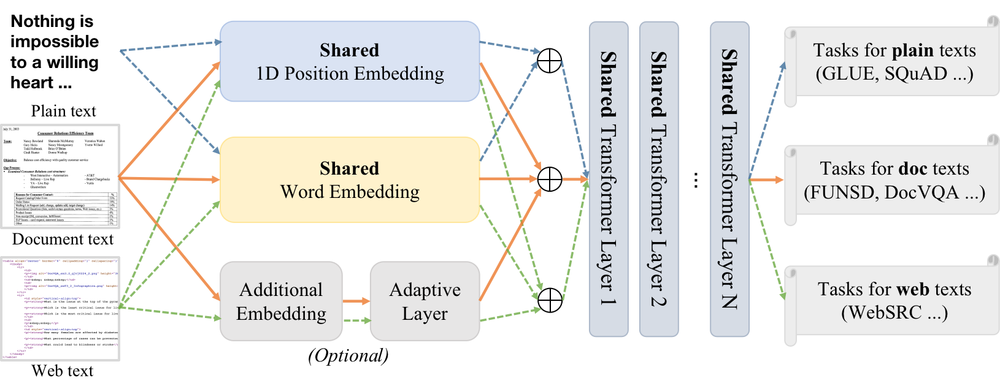

# XDoc

## Introduction

XDoc is a unified pre-trained model that deals with different document formats in a single model. With only 36.7% parameters, XDoc achieves comparable or better performance on downstream tasks, which is cost-effective for real-world deployment.

[XDoc: Unified Pre-training for Cross-Format Document Understanding](https://arxiv.org/abs/2210.02849)
Jingye Chen, Tengchao Lv, Lei Cui, Cha Zhang, Furu Wei, [EMNLP 2022](#)

The overview of our framework is as follows:

<div align="center">

</div>

## Download


### Pre-trained Model
|   Model  | Download |
| -------- | -------- |
| xdoc-pretrain-roberta-1M    | [xdoc-base](https://huggingface.co/microsoft/xdoc-base) |

### Fine-tuning Models
|   Model  | Download |
| -------- | -------- |
| xdoc-squad1.1    | [xdoc-squad1.1](https://huggingface.co/microsoft/xdoc-base-squad1.1) |
| xdoc-squad2.0    | [xdoc-squad2.0](https://huggingface.co/microsoft/xdoc-base-squad2.0) |
| xdoc-funsd    | [xdoc-funsd](https://huggingface.co/microsoft/xdoc-base-funsd) |
| xdoc-websrc | [xdoc-websrc](https://huggingface.co/microsoft/xdoc-base-websrc) |


## Fine-tune


### SQuAD
The dataset will be **automatically downloaded**. Please refer to ```./fine_tuning/squad/```.

#### Installation
```
pip install -r requirements.txt
```

#### Train
To train XDoc on SQuADv1.1

```bash
CUDA_VISIBLE_DEVICES=0 python run_squad.py \
  --model_name_or_path microsoft/xdoc-base \
  --dataset_name squad \
  --do_train \
  --do_eval \
  --per_device_train_batch_size 16 \
  --learning_rate 3e-5 \
  --num_train_epochs 2 \
  --max_seq_length 384 \
  --doc_stride 128 \
  --output_dir ./v1_result \
  --overwrite_output_dir
```

To train XDoc on SQuADv2.0

```bash
CUDA_VISIBLE_DEVICES=0 python run_squad.py \
  --model_name_or_path microsoft/xdoc-base \
  --dataset_name squad_v2 \
  --do_train \
  --do_eval \
  --version_2_with_negative \
  --per_device_train_batch_size 16 \
  --learning_rate 3e-5 \
  --num_train_epochs 4 \
  --max_seq_length 384 \
  --doc_stride 128 \
  --output_dir ./v2_result \
  --overwrite_output_dir
```

#### Test
To test XDoc on SQuADv1.1


```bash
CUDA_VISIBLE_DEVICES=0 python run_squad.py \
  --model_name_or_path microsoft/xdoc-base-squad1.1 \
  --dataset_name squad \
  --do_eval \
  --per_device_train_batch_size 16 \
  --learning_rate 3e-5 \
  --num_train_epochs 2 \
  --max_seq_length 384 \
  --doc_stride 128 \
  --output_dir ./squadv1.1_result \
  --overwrite_output_dir
```

To test XDoc on SQuADv2.0

```bash
CUDA_VISIBLE_DEVICES=0 python run_squad.py \
  --model_name_or_path microsoft/xdoc-base-squad2.0 \
  --dataset_name squad_v2 \
  --do_eval \
  --version_2_with_negative \
  --per_device_train_batch_size 16 \
  --learning_rate 3e-5 \
  --num_train_epochs 4 \
  --max_seq_length 384 \
  --doc_stride 128 \
  --output_dir ./squadv2.0_result \
  --overwrite_output_dir
```


### FUNSD
The dataset will be **automatically downloaded**. Please refer to ```./fine_tuning/funsd/```.

#### Installation

```bash
pip install -r requirements.txt
```

Also, you need to install ```detectron2```. For example, if you use torch1.8 with cuda version 10.1, you can use the following command

```bash
pip install detectron2 -f https://dl.fbaipublicfiles.com/detectron2/wheels/cu101/torch1.8/index.html
```

#### Train

```bash
CUDA_VISIBLE_DEVICES=0 python -m torch.distributed.launch --nproc_per_node=1 --master_port 5678 run_funsd.py \
        --model_name_or_path microsoft/xdoc-base \
        --output_dir camera_ready_funsd_1M \
        --do_train \
        --do_eval \
        --max_steps 1000 \
        --warmup_ratio 0.1 \
        --fp16 \
        --overwrite_output_dir \
        --seed 42
```

#### Test

```
CUDA_VISIBLE_DEVICES=0 python -m torch.distributed.launch --nproc_per_node=1 --master_port 5678 run_funsd.py \
        --model_name_or_path microsoft/xdoc-base-funsd \
        --output_dir camera_ready_funsd_1M \
        --do_eval \
        --max_steps 1000 \
        --warmup_ratio 0.1 \
        --fp16 \
        --overwrite_output_dir \
        --seed 42
```

### WebSRC
The dataset will be **manually downloaded**. After downloading, please modify the argument ```--web_train_file```, ```--web_eval_file```, ```web_root_dir```, and ```root_dir``` in args.py.

#### Installation

```bash
pip install -r requirements.txt
```

#### Train

```bash
CUDA_VISIBLE_DEVICES=0 python run_docvqa.py --do_train True --do_eval True  --model_name_or_path microsoft/xdoc-base
```

#### Test
```bash
CUDA_VISIBLE_DEVICES=0 python run_docvqa.py --do_train False --do_eval True --model_name_or_path microsoft/xdoc-base-websrc
```


## Result

* To verify the model accuracy, we select the GLUE benchmark and SQuAD to evaluate plain text understanding, FUNSD and DocVQA to evaluate doc-
ument understanding, and WebSRC for web text understanding. Experimental
results have demonstrated that XDoc achieves comparable or even better performance on these tasks.

| Model      | MNLI-m | QNLI | SST2 | MRPC | SQUAD1.1/2.0 | FUNSD | DocVQA | WebSRC |
| :----------: | :------: | :----: | :----: | :----: | :------------: | :-----: | :------: | :------: |
| RoBERTa    | **87.6**   | **92.8** | 94.8 | 90.2 | **92.2**/83.4    | -     | -      | -      |
| LayoutLM   | -      | -    | -    | -    | -            | 79.3  | 69.2   | -      |
| MarkupLM   | -      | -    | -    | -    | -            | -     | -      | 74.5   |
| **XDoc(Ours)** | 86.8   | 92.3 | **95.3** | **91.1** | 92.0/**83.5**    | **89.4**  | **72.7**   | **74.8**   |

* With only 36.7% parameters, XDoc achieves comparable or even better performance on a variety of downstream tasks compared with the individual pre-trained models, which is cost effective for real-world deployment.

| Model      | Word | 1D Position | Transformer | 2D Position | XPath | Adaptive | Total |
| :----------: | :----: | :-----------: | :-----------: | :-----------: | :-----: | :--------: | :-----: |
| RoBERTa    | √  | √         | √         | -           | -     | -        | 128M  |
| LayoutLM   | √  | √         | √         | √         | -     | -        | 131M  |
| MarkupLM   | √  | √         | √         | -           | √   | -        | 139M  |
| **XDoc(Ours)** | √  | √         | √         | √         | √   | √      | 146M  |


## Citation

If you find XDoc helpful, please cite us:
```
@article{chen2022xdoc,
  title={XDoc: Unified Pre-training for Cross-Format Document Understanding},
  author={Chen, Jingye and Lv, Tengchao and Cui, Lei and Zhang, Cha and Wei, Furu},
  journal={arXiv preprint arXiv:2210.02849},
  year={2022}
}
```


## License

This project is licensed under the license found in the LICENSE file in the root directory of this source tree.
Portions of the source code are based on the [transformers](https://github.com/huggingface/transformers).
[Microsoft Open Source Code of Conduct](https://opensource.microsoft.com/codeofconduct)

## Contact

For help or issues using XDoc, please submit a GitHub issue.

For other communications, please contact Lei Cui (`lecu@microsoft.com`), Furu Wei (`fuwei@microsoft.com`).


